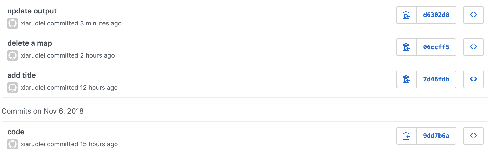

# INF 554 Assignment 10

[a10.html](http://rpubs.com/xiaruolei/a10)

## Plots

### 1. Basic Plots

* Scatterplot	
* Scatterplot with Text	
* Bar 
* Line chart	
* Area chart	
* Dot plot	
* Histogram	
* Frequency polygon	
* Box plot	
* Violin plot	

### 2. Plotly chart

### 3. Facet plot

### 4. Map


## Software Environment
R and R Studio

## Set Up and Deployment

```
//ggplot2
install.packages("ggplot2")
install.packages("plotly")
install.packages("ggmap")
install.packages("lubridate")
install.packages("dplyr")
install.packages("plyr")
```

## Data Source
In data folder. The data is about LA collision and it's sensor.

## Git

