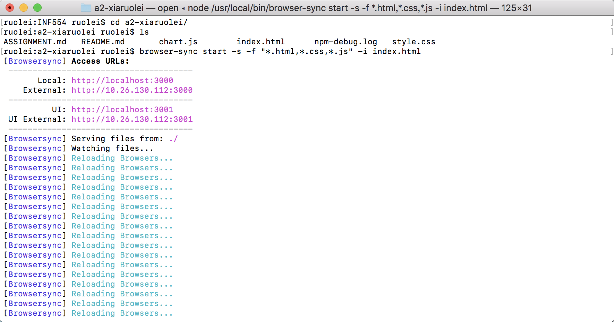
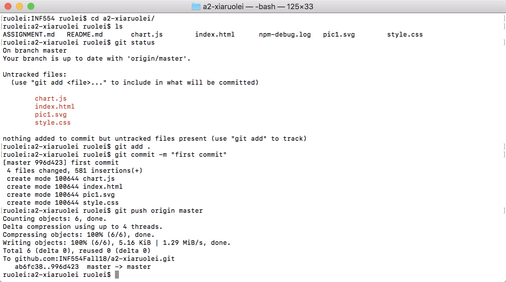

# INF 554 Assignment 2

## Data 
Data demonstrates total fertility rate trend (live births per woman) from 2000 to 2005.

[Google Sheet link](https://docs.google.com/spreadsheets/d/1ZsgJACSeLJUy-GQl3cqGvm0-9brEQObaqcAcRcSCD2c/edit#gid=1297915953)

## Node.js
- Install Browserync to use everywhere: npm install 
```
browser-sync -g #-g switch for global install
```
- Start Browserync:
```
browser-sync start --server -f "*.html,*.css" --index file.html
```


## Web development techniques
HTML, CSS, Javascript

## Git 


## SVG Prototype
- Install Inkscape
- Create and style circle and text
- Align
- Duplicate and move
- Resize page to content and save
- Load SVG file in the page using 

## SVG Code
- Use [RawGraphs](http://app.rawgraphs.io) getting location and size of each bubble
- Create \<svg> in the page
- Create bubbles as \<circle>, customize styles
- Move style attributes to style.css

## Dynamic SVG
- Create \<svg> to draw into with an id
- Load javascript at the end of the page
- Use javascript to “get” the \<svg> by id and create bubble
- Put my javascript code in chart.js