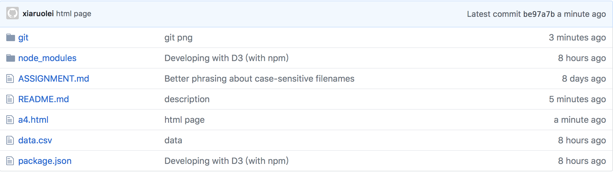
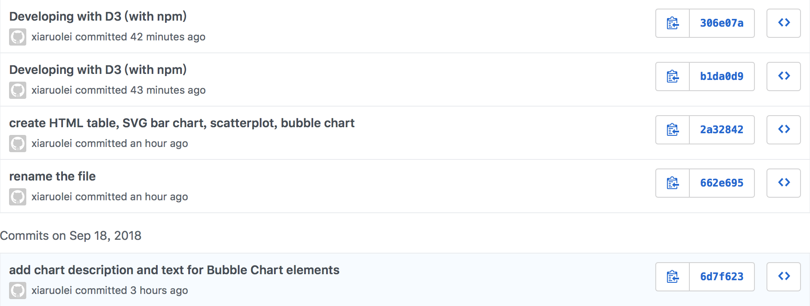

# INF 554 Assignment 4

## Data Source
[https://data.worldbank.org](http://data.worldbank.org)

## Publish work on USC SCF 
[a4.html](http://www-scf.usc.edu/~ruoleixi/a4.html)

## Work
* Download *Rural population (% of total population)* data from link above, then I remove some countries locally after downloading the data file and get 20 countries data on 2017.
* Load the data as CSV using D3. With D3 data join, create an HTML table, an SVG bar chart, an SVG scatterplot, and an SVG bubble chart.
* Publish my work on USC SCF


## Set Up and Deployment
- Develope with D3 (with npm) locally

```
$ npm init
$ npm install browser-sync --save
$ npm install d3 --save
$ browser-sync start --server -f "*.html,*.css" --index a4.html
```

- Use USC SCF for publish

```
scp data.csv ruoleixi@aludra.usc.edu:/home/scf-12/ruoleixi/public_html
scp a4.html ruoleixi@aludra.usc.edu:/home/scf-12/ruoleixi/public_html
scp -r node_modules/ ruoleixi@aludra.usc.edu:/home/scf-12/ruoleixi/public_html
scp package.json ruoleixi@aludra.usc.edu:/home/scf-12/ruoleixi/public_html
```

## Git


