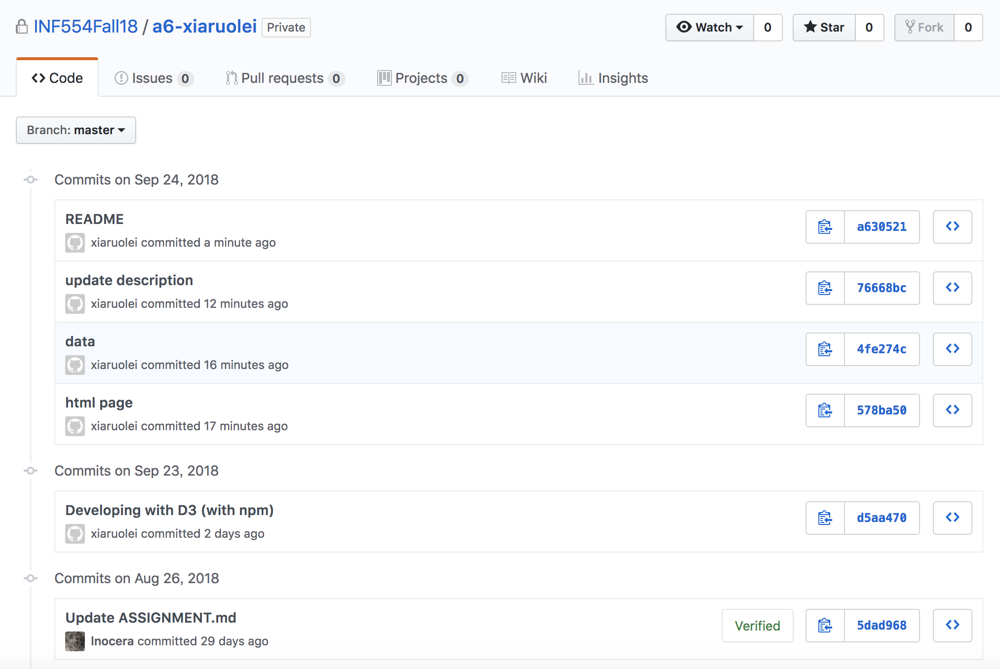

# INF 554 Assignment 6

## Data Source
[https://data.worldbank.org](http://data.worldbank.org)

## Publish Work On USC SCF 
[a6.html](http://www-scf.usc.edu/~ruoleixi/a6.html)

## Work
* Download *Rural population (% of total population)* data from link above, then I remove some countries locally after downloading the data file and get 20 countries data of year 2017 and save as data.json.
* Also Download data of year of 1960 and 2017 and do some processing, save as data_slope.json.
* Load the data as JSON using D3. With D3 data join, create an SVG table, scatterplot, bar chart and slope graph.
* All plots use D3 scales.
* Scatterplot and bar chart include axes, axes labels, tick marks, and tick mark labels. 
* Publish my work on USC SCF


## Set Up and Deployment
- Develope with D3 (with npm) locally

```
$ npm init
$ npm install browser-sync --save
$ npm install d3 --save
$ browser-sync start --server -f "*.html,*.css" --index a6.html
```

- Use USC SCF for publish

```
scp data.json ruoleixi@aludra.usc.edu:/home/scf-12/ruoleixi/public_html
scp a6.html ruoleixi@aludra.usc.edu:/home/scf-12/ruoleixi/public_html
scp -r node_modules/ ruoleixi@aludra.usc.edu:/home/scf-12/ruoleixi/public_html
scp package.json ruoleixi@aludra.usc.edu:/home/scf-12/ruoleixi/public_html
```

## Git

