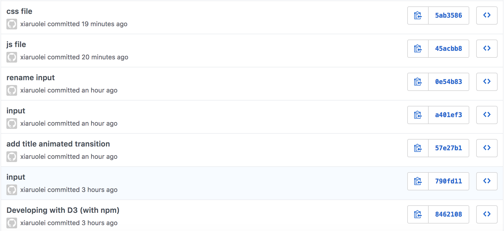

# INF 554 Assignment 7

## Data Source
[UNdata](http://data.un.org/)

## Publish Work On USC SCF 
[a7.html](http://www-scf.usc.edu/~ruoleixi/a7.html)

## Work
* Download *Total fertility rate (live births per woman) in 2010-2015* data from link above, then I change the format of data into JSON locally and get 10 countries data of year 2010-2015 and save as data_a7.json.
* Load the data as JSON using D3. With D3 data join, create an Bar chart.
* Bar chart include axes, axes labels, tick marks, and tick mark labels. 
* There are 7 buttons:
    1. "reset": show all 10 countries, sorted alphabetically. This is the same as the starting state.
    2. "all 10": show all 10 countries, keep current sorting order
    3. "top 5": show top 5 (by value) countries, keep current sorting order
    4. "bottom 5": show bottom 5 (by value) countries, keep current sorting order
    5. "sort alphabetically": keep current countries, sort them alphabetically
    6. "sort ascending by value": keep current countries, sort them by values ascending
    7. "sort descending by value": keep current countries, sort them by values descending
* Code is broken down into a7.html, style.css and chart.js files
* Use D3 scales
* Use bootstrap
* Publish my work on USC SCF


## Set Up and Deployment
- Develope with D3 (with npm) locally

```
$ ng new a8-app
$ cd a8-app/
$ mv * ../
$ cd ..
$ npm install bootstrap jquery popper.js d3 @types/d3 --save
$ ng generate component bubble-chart
$ ng generate component line-chart
$ ng generate component pie-chart
$ ng serve --open
$ ng build --base-href=/~ruoleixi/a8/
```

- Use USC SCF for publish

```
scp data_a7.json ruoleixi@aludra.usc.edu:/home/scf-12/ruoleixi/public_html
scp a7.html ruoleixi@aludra.usc.edu:/home/scf-12/ruoleixi/public_html
scp style.css ruoleixi@aludra.usc.edu:/home/scf-12/ruoleixi/public_html
scp chart.js ruoleixi@aludra.usc.edu:/home/scf-12/ruoleixi/public_html
scp -r node_modules/ ruoleixi@aludra.usc.edu:/home/scf-12/ruoleixi/public_html
scp package.json ruoleixi@aludra.usc.edu:/home/scf-12/ruoleixi/public_html
scp package-lock.json ruoleixi@aludra.usc.edu:/home/scf-12/ruoleixi/public_html
```

## Git

