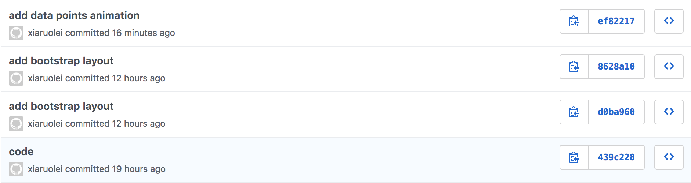

# INF 554 Assignment 8

## Data Source
[UNdata](http://data.un.org/)

## Publish Work On USC SCF 
[a8.html](http://www-scf.usc.edu/~ruoleixi/a8/)

## Set Up and Deployment
- Development server

```
$ ng new a8
$ cd a8/
$ mv * ../
$ mv .gitignore .editorconfig ../
$ cd ..
$ npm install bootstrap jquery popper.js d3 @types/d3 --save
$ ng generate component bubble-chart
$ ng generate component line-chart
$ ng generate component pie-chart
$ ng serve --open
```
- Build

```
$ ng build --base-href=/~ruoleixi/a8/
```
- angular.json

```
"styles": [
	"src/styles.css",
	"node_modules/bootstrap/dist/css/bootstrap.min.css"
],
"scripts": [
	"node_modules/jquery/dist/jquery.min.js",
	"node_modules/bootstrap/dist/js/bootstrap.min.js"
]
```
            
- Use USC SCF for publish

```
$ scp -r data8_pie.csv data8_bubble.json data8_line.csv ruoleixi@aludra.usc.edu:/home/scf-12/ruoleixi/public_html/a8
$ cd dist/
$ scp -r a8/ ruoleixi@aludra.usc.edu:/home/scf-12/ruoleixi/public_html
```

## Git


## Bubble chart
Data is imported as JSON. Uses D3 data join and circle packing layout. When mouse hovers a bubble, tooltips show the each bubble's information.

## Line chart
Data is imported as CSV. This chart is a responsive line chart. And when mouse hovers on a legend, selected line has a pop-out effect and only the points on this line appear, other points are hidden. When hover on a point on a line, this point becomes larger and tooltip shows it's information.

## Pie chart
Data is well formatted imported as CSV. Uses D3 data join and pie layout. Mouse hover on the pie, card update information. 


## Development server

Run `ng serve` for a dev server. Navigate to `http://localhost:4200/`. The app will automatically reload if you change any of the source files.

## Code scaffolding

Run `ng generate component component-name` to generate a new component. You can also use `ng generate directive|pipe|service|class|guard|interface|enum|module`.

## Build

Run `ng build` to build the project. The build artifacts will be stored in the `dist/` directory. Use the `--prod` flag for a production build.

## Running unit tests

Run `ng test` to execute the unit tests via [Karma](https://karma-runner.github.io).

## Running end-to-end tests

Run `ng e2e` to execute the end-to-end tests via [Protractor](http://www.protractortest.org/).

## Further help

To get more help on the Angular CLI use `ng help` or go check out the [Angular CLI README](https://github.com/angular/angular-cli/blob/master/README.md).
