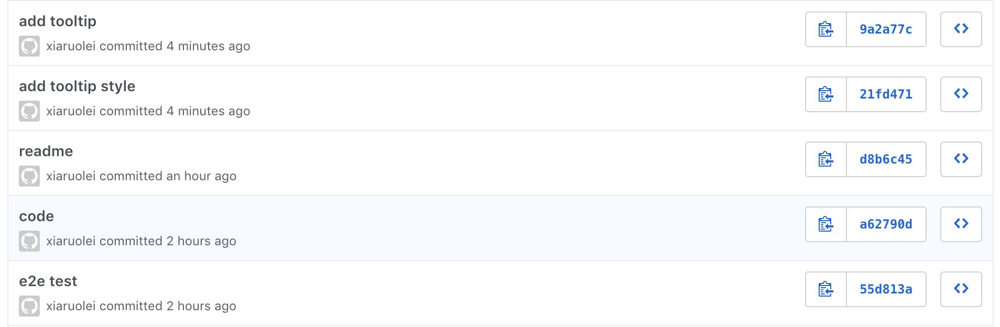

# INF 554 Assignment 9

## Data Source
[UNdata](http://data.un.org/)

[LA County Bookstores](https://data.lacounty.gov/Arts-and-Culture/LA-County-Bookstores-2013/a3k2-6v7z)

[World Data Source](https://data.worldbank.org/)

[LA County Data Source](http://boundaries.latimes.com/set/la-county-neighborhoods-v6/)

## Publish Work On USC SCF 
[a9.html](http://www-scf.usc.edu/~ruoleixi/a9/)

## Set Up and Deployment
- Development server

```
$ ng new a9
$ cd a9/
$ mv * ../
$ mv .gitignore .editorconfig ../
$ cd ..
$ npm install bootstrap jquery popper.js d3 @types/d3 --save
$ ng generate component proportional-symbol-map
$ ng generate component choropleth-map
$ ng generate component los-angeles-county-map
$ ng serve --open
```
- Build

```
$ ng build --base-href=/~ruoleixi/a9/
```
            
- Use USC SCF for publish

```
$ cd dist/
$ scp -r a9/ ruoleixi@aludra.usc.edu:/home/scf-12/ruoleixi/public_html
$ cd ..
$ scp -r a9.1.json bookstore.json world.geo.json la.json ruoleixi@aludra.usc.edu:/home/scf-12/ruoleixi/public_html/a9
```

## Git


## Proportional Symbol Map
Map is imported as GeoJSON and data is imported as JSON. Use D3 data join to load data. When mouse hovers a bubble, tooltips show the each bubble's information.

## Choropleth Map
Map is imported as GeoJSON and data is imported as JSON. Use D3 data join to load data. When hover on an colored area, tooltip shows it's information.

## Los Angeles County Map
Map and data are imported as GeoJSON. Uses D3 data join to load data. 